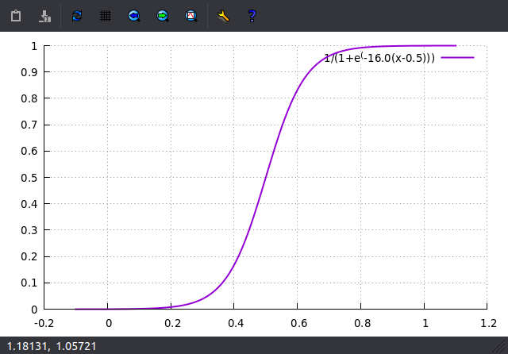

## Intro

A spline is a parametric interpolator. Given a set of control points (of any dimension), and a single scalar input, it produces a weighted sum of the control points.

Bezier curves are nice because they parametize between 0 and 1. However, interpolation requires taking all the control points into account, which can become computationally intensive for complex paths. Most Bezier curve implementations limit their order to 4 control points, and produce complex curves by chaining them together. This can result in problems when mathematical continuity is required from segment to segment.

In contrast, b-splines are "piece-wise", meaning that a finite number of control points affect localized segments of the curve, while simultaneously maintaining mathematical continuity (except in the case where multiple control points coincide). Computationally, this makes them scale much better with the number of control points.

With both Bezier curves and b-splines, interpolation along the curve is not guaranteed to be linear vis-à-vis the input value. Therefore, to produce predictable movement along the curve, one must pre-compute the parametric values based on arc-length. In other words: given a desired arc length, `n`, we must solve for the input parameter, `i`.

Calculating arc length analytically involves integral calculus which is not so easy on piece-wise polynomials, which are the basis functions for b-splines. Fortunately, it can be done numerically with Gauss-Legendre integration. Likewise, solving for `i` can be done numerically with the Newton-Raphson method.

Again, the piece-wise nature of the b-spline has computational advantages, as the numerical solutions need not be computed for the entire curve, but only the relevant segment.

Here, I describe a simple C++ implementation, which I have incorporated into our project to interpolate Reachy trajectories.

## Steps to achieve outcome

1. Ensure your system is set up for C++ development.

    ```bash
    $ g++ --version
    ```

    This should produce something like this:

    ```bash
    g++ (Ubuntu 9.3.0-17ubuntu1~20.04) 9.3.0
    Copyright (C) 2019 Free Software Foundation, Inc.
    This is free software; see the source for copying conditions.  There is NO
    warranty; not even for MERCHANTABILITY or FITNESS FOR A PARTICULAR PURPOSE.
    ```

    If not, execute the following, and try again.

    ```bash
    $ sudo apt install build-essential
    ```

2. Clone the BSplineCPP source repo.

    ```bash
    $ git clone git@github.com:CircuitLaunch/BSplineCPP
    ```

3. Build the project.

    ```bash
    $ mkdir BSplineCPP/build
    $ cd BSplineCPP/build
    $ cmake ..
    $ make
    ```

4. This will produce a single executable in the build directory, which you can execute with:

    ```bash
    $ ./test
    ```

## Explanation

The class that performs the interpolation is `BSpline`, declared in `BSpline.hpp` and defined in `BSpline.cpp`. This is the class that employs piece-wise polynomials to blend the control points parametrically. The class that performs the parametization is `Parametizer`, delcared and defined in `Parametizer.hpp` and `Parametizer.cpp`. The Parametizer class makes use of the `legendreIntegrate()` function in `Legendre.hpp` and `Legendre.cpp` to perform numerical integration, and `newtonSolve()` in `Newton.hpp` and `Newton.cpp`, to solve numerically for parametric input values, given desired arc lengths. `Parametizer` also defines several subclasses of `Functor` (`Functor.hpp`), which is basically a C++ object that behaves like a function to permit me to pass them around like arguments without having to employ function pointers.

In `test.cpp`, after some includes, the first thing you will see is a large array of numbers. This is just sample data. It is an actual trajectory generated by moveit for one of Reachy's arms.

```cpp
float cps[] =
{
  0.0, 0.0, 0.0, 0.0, 0.0, 0.0, 0.0,
  0.02787076249348602, -0.017719376641930098, -0.010315414918655091, 0.014146403438079295, -0.006889147881843044, -0.012896169263600172, 0.006283828771088784,
  0.05574152498697204, -0.035438753283860196, -0.020630829837310183, 0.02829280687615859, -0.013778295763686088, -0.025792338527200344, 0.012567657542177568,
  0.08361228748045806, -0.0531581299257903, -0.030946244755965274, 0.042439210314237884, -0.02066744364552913, -0.03868850779080051, 0.018851486313266354,
  0.11148304997394408, -0.07087750656772039, -0.041261659674620366, 0.05658561375231718, -0.027556591527372176, -0.05158467705440069, 0.025135315084355136,
.
.
.
```

You might wonder why we need to interpolate if MoveIt is sending us 50 control points. If you consider that smooth animation often requires a frame-rate of 30 Hz, that's 120 frames for 2 seconds, and 180 frames for 3 seconds of movement. Besides, there's no guarantee that MoveIt will generate a predictable number of control points.

Following the array, you will find `main()`. This is the entry point. `arcv` and `argv` pass in command line arguments. These are not used in my code.

```cpp
int main(int argc, const char * argv[])
{
```

The first thing the code does is calculate the number of control points in the trajectory.

```cpp
	int cpCount = sizeof(cps) / sizeof(float) / 7;
 	cout << "Control point count: " << cpCount << endl;
```

`sizeof()` returns the number of bytes occupied by an object or variable. Thus `sizeof(cps)` returns the number of bytes occupied by the cps array. Each element in the cps array is a floating point, the size of which is 4 bytes, but can be established in a portable manner by calling `sizeof(float)`. Dividing the number of bytes in the array, by the number of bytes per element returns the number of elements in the array. Each control point consists of 7 elements (7 joints), and therefore, dividing by 7 returns the number of control points. `cout` is a C++ object provided by the standard C++ library to stream output to the console. You can stream strings and other values with the `<<` output stream operator. `endl` is equivalent to `"\n"`, the end of line string.

BSpline does not allocate any memory, so the caller must provide a buffer containing the control point data, and a buffer for the knot vector. The control point buffer has been defined statically. The knot vector should be a float array with enough capacity to contain `cpCount` + `order`, where `cpCount` is the number of control points, and `order` is the order of the b-spline (this is 4 by default). Therefore, by default, if you have 20 control points, your knot vector must be at least 24 floats in size.

```cpp
	float knots[cpCount + 4];
```

I'm performing this on the stack, which is probably not a good idea, especially with larger data sets. In working code, allocate dynamically, or statically on the heap.

The reason I allocate these buffers outside of `BSpline`, is because I originally intended to use this class on an Arduino which benefits from efficient memory management. I did not want to leave it up to C++ to perform any dynamic memory allocation. Even with very complex paths with up to 50 control points, an Arduino can perform an interpolation within 3 milliseconds, which is far more than fast enough to achieve multiple high frequency trajectories.

Next I call BSpline::init() to initialize the knot vector. The first parameter is the number of floats per control point, i.e., the stride of the control point data. The second parameter is the number of control points. A third parameter can be passed in to specify the order, but the default value is 4 and should suffice for most purposes.

```cpp
	spline.init(7, cpCount);
```

At this point the spline object is ready to interpolate. However, for the reasons posed in the intro, we must first calculate an array of parametric values to produce predictable interpolation along the curve. I instantiate a `Parametizer` object to do this. The initializer calculates the lengths of all the segments using Gauss-Legendre integration, caching them in an internal array, as well as the overall length of the entire spline curve.

```cpp
	Parametizer param(spline);
 	param.init();
 	cout << "Spline length: " << param.length << endl;
```

The `parametizeSigmoidal()` function generates a vector of parametric values. The first value in this vector corresponds to the beginning of the curve, and the last value corresponds to the end.

```cpp
	vector<float> easedParametization = param.parametizeSigmoidal(20);
```

You will notice that, unlike with Bezier curves, these parametric values are not normalized. The function produces a sigmoidal movement along the curve determined by:

&emsp;&emsp;&emsp;&emsp;}})

Where  is the distance along the curve,  is the length of the entire curve, and  is a value between 0 and 1. Here is a plot over a unit length curve.

&emsp;&emsp;&emsp;&emsp;

The `parametizeSigmoidal()` function iterates through a series of $l$ values and uses the Newton-Raphson method to approximate the parametric inputs that will result in those values.

Gauss-Legendre and Newton-Raphson are relatively compute intensive and were not to be performed on the Arduino but on the host system, and only the parametric vector sent to the Arduino for execution. And that is also why I don't care about using C++ `std::vector` in this case.

The parametric interpolation can now be performed.

```cpp
	float goal[7];
	for(int j = 0; j < easedParametization.size(); j++) {
	    spline.eval(easedParametization[j], goal);
	    cout << " (" << goal[0];
	    for(int i = 1; i < 7; i++) {
	        cout << ", " << goal[i];
	    }
	    cout << ")" << endl;
	}
```

For illustrative purposes, the test program goes on to print out some telemetry to allow you to compare naÏve, linear, and sinusoidal parametization. The first column lists the parametric values input to `BSpline::eval()`. The second column, is the distance along the curve. And the final column is the delta in the distance between successive parametric values. Moveit is pretty good at generating uniformly spaced control points. Even so, you might notice some strange stretching at the extremities.

```cpp
	cout << "Naive parametization" << endl;
 	float step = knots[cpCount + 3] / 20.0;
	for(int i = 1; i <= 20; i++) {
	    float t0 = (i-1) * step;
	    float t1 = i * step;
	    float a0 = param.arcLength(t0);
	    float a1 = param.arcLength(t1);
	    cout << "Arc " << setw(2) << i
		 << " t: " << setw(7) << setprecision(4) << fixed << right << t1
		 << " l: " << setw(7) << setprecision(4) << fixed << right << a1
		 << " d: " << setw(7) << setprecision(4) << fixed << right << a1 - a0
		 << endl;
	}
	cout << endl;
```

Linear parametization eliminates the stretching and guarantees uniform interpolation from beginning to end.

```cpp
	cout << "Linear parametization" << endl;
  	vector<float> jerkyParametization = param.parametizeLinear(20);
  	for(int i = 1; i < jerkyParametization.size(); i++) {
	    float t0 = jerkyParametization[i-1];
	    float t1 = jerkyParametization[i];
	    float a0 = param.arcLength(t0);
	    float a1 = param.arcLength(t1);
	    cout << "Arc " << setw(2) << i
      		 << " t: " << setw(7) << setprecision(4) << fixed << right << t1
      		 << " l: " << setw(7) << setprecision(4) << fixed << right << a1
      		 << " d: " << setw(7) << setprecision(4) << fixed << right << a1 - a0
      		 << endl;
  	}
  	cout << endl;
```

The sinusoidal parametization produces a cushy acceleration and deceleration.

```cpp
	cout << "Eased parametization" << endl;
	for(int i = 1; i < easedParametization.size(); i++) {
	    float t0 = easedParametization[i-1];
	    float t1 = easedParametization[i];
	    float a0 = param.arcLength(t0);
 	    float a1 = param.arcLength(t1);
	    cout << "Arc " << setw(2) << i
	         << " t: " << setw(7) << setprecision(4) << fixed << right << t1
	         << " l: " << setw(7) << setprecision(4) << fixed << right << a1
	         << " d: " << setw(7) << setprecision(4) << fixed << right << a1 - a0
	         << endl;
	}

	return 0;
```
